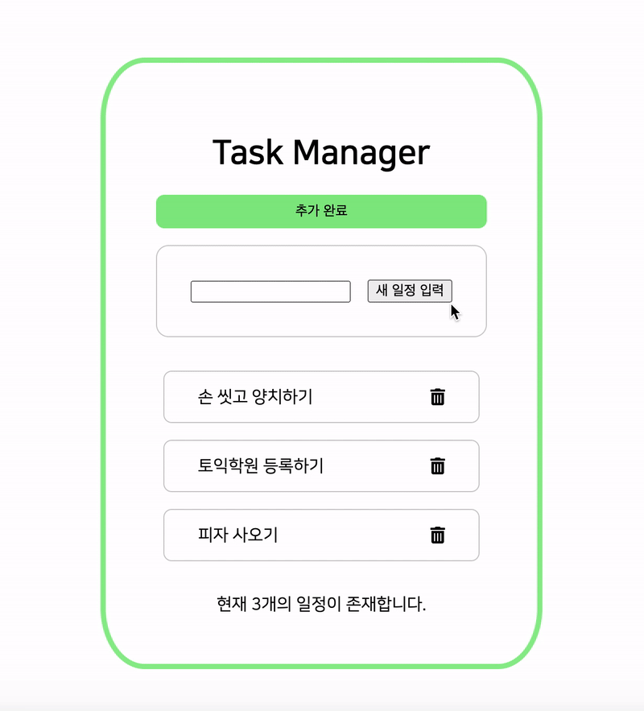

## Simple Todo App with Vue 3.0

프론트엔드 라이브러리를 배운다면, 투두앱은 만들어 봐야겠죠?!  
Vue 3를 배우며 제작한 심플 투두 어플리케이션입니다.

### 구현 기능

- 일정 추가 / 삭제
- 남은 일정 갯수 표시
- 공백 입력 금지 (validation)

### 새로 습득한 내용

- methods 에는 화살표 함수를 사용할 수 없다.
